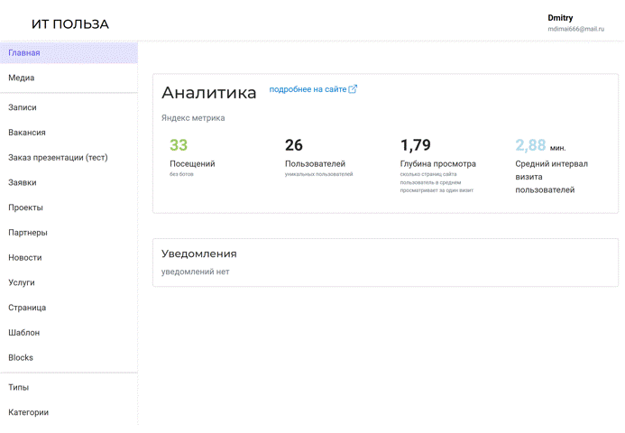

<p align="center">
  <a href="https://Mars-dotnet.org/#gh-light-mode-only">
    
  </a>
  <!-- <a href="https://Mars-dotnet.org/#gh-dark-mode-only">
    
  </a> -->
</p>

<h3 align="center">CMS с открытым исходным кодом, self-hosted или облако — все под вашим контролем.</h3>

<p align="center">The dotnet C# open-source CMS, asp net core based and Blazor.</p>
<p align="center"><a href="https://cloud.Mars-dotnet.org/signups?source=github1">Cloud</a> · <a href="https://Mars-dotnet.org/demo">Try live demo</a></p>

<p align="center">
  <span href="">RU</span> · 
  <a href="https://cloud.Mars-dotnet.org/signups?source=github1">EN</a>
</p>

<p align="center">
  <a href="https://www.nuget.org/packages/mdimai666.Mars.Core">
    
  </a>
  <a href="LICENSE">
    
  </a>
  <a href="https://dotnet.microsoft.com/download">
    
  </a>
</p>

<br>

<p align="center">
  <a href="https://Mars-dotnet.org">
    
  </a>
</p>

<br>

Mars — это бесплатная CMS с открытым исходным кодом, позволяющая вам управлять любым контентом как угодно.

- **Self-hosted или Cloud**: Вы можете размещать и масштабировать проекты Mars по своему усмотрению. Вы можете сэкономить время, выполнив развертывание в [Mars Cloud](https://cloud.Mars-dotnet.org/signups?source=github1) или на желаемой хостинговой платформе\*\*: AWS, Azure, Google Cloud, DigitalOcean.
- **Современная панель администратора**: элегантная, полностью настраиваемая и полностью расширяемая панель администратора. Так же есть готовые компоненты для построения своей.
- **Поддержка нескольких баз данных**: вы можете выбрать предпочитаемую базу данных: PostgreSQL, MSSQL, MySQL, MariaDB и SQLite.
- **Расширяемость**: вы можете быстро построить свою модель данных; логику в визуальном редакторе; маршруты или установить плагины.
- **Быстрый и надежный**: Созданный на основе кроссплатформенного asp net core и С#. 
- **Мультифронт**: приложение может запускать несколько фронт-интерфейсов: SPA, статический HTML, шаблон, Blazor.
- **Любой внеший интерфейс**: используйте любую интерфейсную среду SPA (React, Next.js, Vue, Angular и т. д.), мобильные приложения или даже IoT.

## 😀 Начало

Прочитайте [руководство по началу работы](https://mdimai666.github.io/Mars/md/QuickStart.md) или следуйте инструкциям ниже:

### Запуск в Docker
[docker hub](https://hub.docker.com/r/mdimai666/mars/)

```
docker run -d --name mars-app-nocontent -w /app -p 5005:80  -e "ConnectionStrings__DefaultConnection=Host=host.docker.internal:5432;Database=mars_docker_app2;Username=postgres;Password=ggxxrr" mdimai666/mars:latest
```

### Docker-composer
файл [docker-compose.yml](https://mdimai666.github.io/Mars/files/docker/docker-compose.yml) и конфиг файл [appsettings.Production.json](https://mdimai666.github.io/Mars/files/docker/appsettings.Production.json)

### Начните с разработки собственного плагина
> Вы работаете с Mars 'из коробки', не меняя его код, а настраивая и расширяя его через node-code и плагины.
[Разработка плагина](https://github.com/mdimai666/MyMarsPlugin)

### Требования
 - OS: Windows, Linux, MacOS
 - Database: postgres 

## Installation

Скачайте и запустите [последнюю версию](https://github.com/mdimai666/Mars/releases) тут

> Mars.exe

### 🚀 Dev Installation

Install [NET10 SDK](https://dotnet.microsoft.com/en-us/download) or [Visual Studio 2022](https://visualstudio.microsoft.com/ru/vs/community/)

```bash
git clone https://github.com/mdimai666/Mars.git
cd Mars/Mars
cp appsettings.json appsettings.Local.json
code appsettings.json #edit config
dotnet watch run
```

**or**

```bash
#winget install mdimai666.Mars
#docker Mars
```

This command generates a brand new project with the default features.

> DOTNET: Currently **NET 10**

**[Смотрите больше на нашем сайте](https://Mars-dotnet.org/overview)**.

## Совместная разработка

Пожалуйста, прочтите наше [Руководство для участников](./CONTRIBUTING.md), прежде чем отправлять pull-request в проект.

## Community support

Общую справку по использованию Mars можно найти в [официальной документации Mars](https://docs.Mars-dotnet.org). Для получения дополнительной помощи вы можете использовать один из этих каналов, чтобы задать вопрос:

- [GitHub](https://github.com/mdimai666/Mars) (Bug reports, Contributions)
<!-- - [Community Forum](https://forum.Mars-dotnet.org) (Questions and Discussions) -->
<!-- - [Feedback section](https://feedback.Mars-dotnet.org) (Roadmap, Feature requests) -->
<!-- - [YouTube Channel](https://www.youtube.com/Mars) (Learn from Video Tutorials) -->

## Roadmap

Ознакомьтесь с нашей [дорожной картой](https://Mars-dotnet.org/roadmap), чтобы быть в курсе последних выпущенных и предстоящих функций. Вы также можете поделиться с нами своим мнением и проголосовать за конкретную функцию.

## Documentation

Документацию по Марс можно найти в нашем специальном [репозитории](https://github.com/mdimai666/Mars/documentation) или просмотреть нашу документацию в реальном времени:

- [Документация для разработчиков](https://mdimai666.github.io/Mars/)
- [Руководство пользователя](https://mdimai666.github.io/Mars/)

## Попробуйте живую демо-версию

Посмотрите сами, что скрывается под капотом, получив доступ к [размещенному проекту Mars](https://Mars-dotnet.orgnn/demo) с примерами данных.

## License

Информацию о лицензировании см. в файле [LICENSE](./LICENSE).
