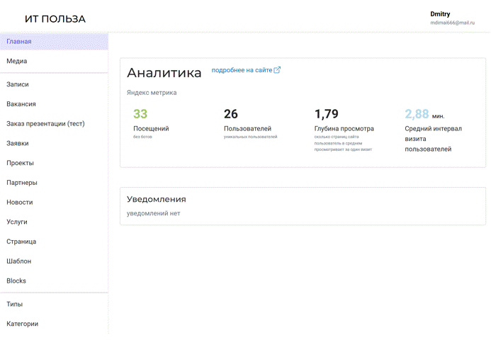

<p align="center">
  <a href="https://Mars-dotnet.org/#gh-light-mode-only">
    
  </a>
</p>

<h3 align="center">Open-source visual programming platform. Build websites, automate tasks, connect anything — all without code.</h3>

<p align="center">Self-hosted or cloud. You stay in control.</p>

<p align="center"><a href="https://cloud.Mars-dotnet.org/signups?source=github1">Cloud</a> · <a href="https://Mars-dotnet.org/demo">Live Demo</a></p>

<p align="center">
  <a href="README.ru.md">Русский</a> · <span>English</span>
</p>

<p align="center">
  <a href="https://www.nuget.org/packages/mdimai666.Mars.Core">
    
  </a>
  <a href="LICENSE">
    
  </a>
  <a href="https://dotnet.microsoft.com/download">
    
  </a>
</p>

<br>

<p align="center">
  <a href="https://Mars-dotnet.org">
    
  </a>
</p>

<br>

## What is Mars?

Mars is a platform that combines **visual programming** with a **flexible content engine**. Connect nodes on a canvas to build websites, APIs, automations, IoT workflows, and data pipelines — no coding required. When you need more power, drop into C# right inside the visual editor.

Inspired by Node-RED and WordPress, Mars gives you the visual simplicity of flow-based programming with the depth of a full-stack platform.

## Key Features

### Visual Programming
- **55+ node types** — HTTP, MQTT, SQL, files, C# code, templates, loops, events, email, and more
- **Flow-based editor** — drag, connect, debug. See your logic as a diagram
- **No-code and low-code** — visual blocks for common tasks, C# when you need full control

### Content Management
- **Custom content types** — create any entity (articles, products, orders, custom data)
- **15 field types** — text, numbers, dates, selects, relations, files, images, nested groups, lists
- **Multi-language content** with categories and taxonomies

### Data Sources
- Connect to **PostgreSQL, MsSQL, MySQL** databases
- Query remote databases visually with SQL nodes
- Introspect schemas, run backups, explore data

### Plugins
- Extend Mars with **.NET assemblies** loaded at runtime
- Backend and frontend (Blazor WebAssembly) plugins
- Upload via admin panel or install from marketplace

### Docker & Automation
- Manage **Docker containers**, images, and volumes from the admin panel
- Built-in **job scheduler** (Quartz.NET) — cron, intervals, daily tasks
- Run external tools and services as part of your workflows

### AI Integration
- **Semantic Kernel** for LLM-powered features
- AI tools available inside visual flows
- Database schema introspection with AI assistance

### Multi-Front
- Serve content as **SPA, static HTML, Blazor, or templates**
- Use any frontend framework (React, Vue, Angular) via API
- Mobile apps and IoT devices connect directly

### Admin Panel
- **Blazor Wasm** single-page application
- Manage everything: content, users, media, plugins, navigation, settings
- Visual node editor integrated into the admin interface

### Observability
- **OpenTelemetry** with Prometheus endpoint
- Structured logging and tracing

## Use Cases

| Use Case | Description |
|----------|-------------|
| **Websites** | CMS with visual logic — build pages, manage content, customize behavior |
| **APIs** | Create REST endpoints visually, connect to databases, transform data |
| **Automation** | Scheduled tasks, data processing, file handling, email notifications |
| **IoT** | MQTT nodes for device communication, smart home workflows |
| **Data Pipelines** | Connect databases, ETL processes, export to any format |
| **Internal Tools** | Admin panels, dashboards, approval workflows |

## Quick Start

### Docker

```bash
docker run -d --name mars-app \
  -w /app -p 5005:80 \
  -e "ConnectionStrings__DefaultConnection=Host=host.docker.internal:5432;Database=mars_app;Username=postgres;Password=your_password" \
  mdimai666/mars:latest
```

Or use **docker-compose** — see [docker-compose.yml](https://mdimai666.github.io/Mars/files/docker/docker-compose.yml) and [appsettings.Production.json](https://mdimai666.github.io/Mars/files/docker/appsettings.Production.json).

### Development

Requirements: [.NET 10 SDK](https://dotnet.microsoft.com/en-us/download) or [Visual Studio 2022](https://visualstudio.microsoft.com/vs/community/)

```bash
git clone https://github.com/mdimai666/Mars.git
cd Mars
cp appsettings.json appsettings.Local.json
# Edit appsettings.Local.json with your database connection
dotnet watch run --project src/Mars.WebApp
```

### Download

Download the latest release from [GitHub Releases](https://github.com/mdimai666/Mars/releases) and run `Mars.exe`.

## Documentation

- [Developer Documentation](https://mdimai666.github.io/Mars/)
- [Quick Start Guide](https://mdimai666.github.io/Mars/md/QuickStart.md)
- [Plugin Development](https://github.com/mdimai666/MyMarsPlugin)

## Deployment

- **OS**: Windows, Linux, macOS
- **Database**: PostgreSQL (recommended), MsSQL, MySQL, SQLite (development)
- **Cloud**: AWS, Azure, Google Cloud, DigitalOcean
- **Docker Hub**: [mdimai666/mars](https://hub.docker.com/r/mdimai666/mars/)

## Community & Support

- [GitHub](https://github.com/mdimai666/Mars) — Bug reports, contributions
- [Website](https://Mars-dotnet.org) — Overview and news
- [Documentation](https://mdimai666.github.io/Mars/) — Guides and API reference

## Tech Stack

- **.NET 10** / ASP.NET Core
- **Blazor** (Server + WebAssembly)
- **Entity Framework Core** — PostgreSQL, MsSQL, MySQL
- **Quartz.NET** — Job scheduling
- **Semantic Kernel** — AI integration
- **Docker.DotNet** — Container management
- **OpenTelemetry** — Observability

## License

MIT License — see [LICENSE](./LICENSE)
